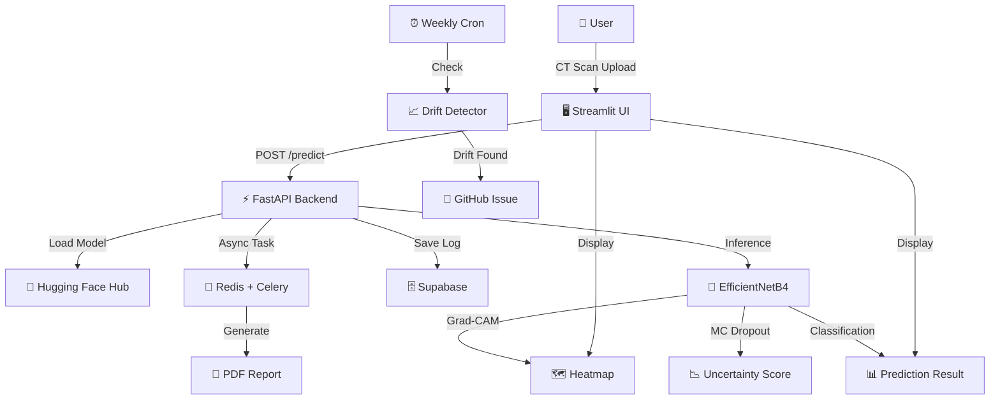

# 🩻 Kidney Tumor Identification System

<div align="center">


**A production-ready deep learning system for kidney CT scan classification with explainable AI.**

[🚀 Live Demo](https://kidney-tumor-identification-system.streamlit.app/) · [🔬 API Docs](https://himel000-kidney-tumor-api.hf.space/docs) · [🤗 Model](https://huggingface.co/Himel000/kidney-tumor-efficientnetb4)

</div>

---

## 📋 Overview

The **Kidney Tumor Identification System** is a production-ready deep learning application that classifies kidney CT scan images into four categories: **Normal**, **Cyst**, **Tumor**, and **Stone**. Built with MLOps best practices, it provides accurate AI-assisted diagnostics with full explainability — designed as a **decision-support tool** for medical research, not a replacement for clinical diagnosis.

> ⚠️ **Disclaimer:** This tool is for research and educational purposes only. It is NOT a clinical diagnostic tool. Always consult a qualified radiologist or physician for medical decisions.

---

## ✨ Features

- **4-class CT scan classification** — Normal, Cyst, Tumor, Stone
- **Grad-CAM heatmaps** — visual explanation of model decisions
- **Monte Carlo Dropout** — uncertainty quantification with confidence intervals
- **PDF report generation** — structured reports with heatmaps and metrics
- **Case history** — prediction audit trail with radiologist feedback
- **REST API** — FastAPI backend for easy integration
- **Self-hostable** — run the entire system with a single Docker command
- **Data drift monitoring** — weekly automated drift detection with Evidently AI
- **MLflow experiment tracking** — full training history on DagsHub
- **CI/CD pipeline** — GitHub Actions for automated testing and deployment

---

## 📊 Model Performance

| Metric | Value |
|---|---|
| **Model** | EfficientNetB4 + Custom Head |
| **Validation Accuracy** | 99.46% |
| **Test AUC-ROC** | 98.38% ✅ |
| **Test Sensitivity** | 85.36% ✅ |
| **Test Specificity** | 95.00% |
| **Test F1 Score** | 85.25% |
| **Image Size** | 380 × 380 |
| **Classes** | Normal, Cyst, Tumor, Stone |
| **Training Data** | 12,446 CT scan images |

---

## 🏗️ Architecture



---

## 🛠️ Tech Stack

| Layer | Technology |
|---|---|
| **Deep Learning** | TensorFlow, EfficientNetB4 |
| **Explainability** | Grad-CAM, Monte Carlo Dropout |
| **MLOps** | MLflow, DagsHub, DVC |
| **API** | FastAPI, Uvicorn, Celery, Redis |
| **Frontend** | Streamlit |
| **Containerization** | Docker, docker-compose |
| **CI/CD** | GitHub Actions |
| **Monitoring** | Evidently AI |
| **Database** | Supabase (PostgreSQL) |
| **Model Registry** | Hugging Face Hub |
| **Report Generation** | ReportLab |

---

## 🚀 Quick Start

### Option 1 — Try the Live Demo (No Installation)

👉 [https://kidney-tumor-identification-system.streamlit.app/](https://kidney-tumor-identification-system.streamlit.app/)

Upload a kidney CT scan and get instant results — no account needed.

---

### Option 2 — Run Locally with Docker (One Command)

```bash
docker-compose -f docker/docker-compose.yml up --build
```

Then open: `http://localhost:8501`

---

### Option 3 — Call the API from Your Own App

```python
import requests

response = requests.post(
    "https://himel000-kidney-tumor-api.hf.space/api/v1/predict",
    files={"file": open("ct_scan.jpg", "rb")}
)

result = response.json()
print(f"Prediction: {result['predicted_class']}")
print(f"Confidence: {result['confidence']:.2%}")
print(f"Uncertain: {result['is_uncertain']}")
```

Full API documentation: [https://himel000-kidney-tumor-api.hf.space/docs](https://himel000-kidney-tumor-api.hf.space/docs)

---

### Option 4 — Use the Pretrained Model Directly

```python
from huggingface_hub import hf_hub_download
import tensorflow as tf

model_path = hf_hub_download(
    repo_id="Himel000/kidney-tumor-efficientnetb4",
    filename="model.keras"
)
model = tf.keras.models.load_model(model_path)
```

---

### Option 5 — Retrain on Your Own Dataset

```bash
git clone https://github.com/himelds/kidney-tumor-identification-system.git
cd kidney-tumor-identification-system

# Setup
conda create -n kidney-tumor python=3.10 -y
conda activate kidney-tumor
make install

# Configure
cp .env.example .env
# Edit .env with your credentials

# Run data pipeline (CPU)
python main.py

# Run full training pipeline (GPU required)
RUN_TRAINING=true python main.py
```

For GPU-free training, use [Kaggle Notebooks](https://www.kaggle.com/) (free 30 hrs/week GPU):

```bash
%cd /kaggle/working/kidney-tumor-identification-system
!pip install -e . -q
!RUN_TRAINING=true python main.py
```

---

## 📁 Project Structure

```
kidney-tumor-identification-system/
├── src/
│   ├── components/          # ML pipeline components
│   │   ├── data_ingestion.py
│   │   ├── data_validation.py
│   │   ├── data_transformation.py
│   │   ├── prepare_base_model.py
│   │   ├── model_trainer.py
│   │   ├── model_evaluation.py
│   │   ├── gradcam.py
│   │   ├── uncertainty.py
│   │   ├── report_generator.py
│   │   ├── feature_extractor.py
│   │   └── drift_detector.py
│   ├── config/              # Configuration manager
│   ├── constants/           # Project constants
│   ├── entity/              # Config dataclasses
│   ├── pipeline/            # Pipeline stages
│   └── utils/               # Logger, exceptions, common utils
├── api/                     # FastAPI backend
│   ├── middleware/
│   ├── routers/
│   ├── schemas/
│   ├── services/
│   ├── utils/
│   ├── workers/             # Celery async tasks
│   └── Dockerfile
├── app/                     # Streamlit frontend
│   ├── components/
│   └── Dockerfile
├── docker/                  # Docker compose files
├── scripts/                 # Utility scripts
│   ├── generate_reference_features.py
│   └── test_drift_detection.py
├── data/                    # DVC-tracked data pointers
├── .github/workflows/       # CI/CD pipelines
├── tests/                   # Unit and integration tests
├── config/config.yaml       # Project configuration
├── params.yaml              # Training hyperparameters
├── dvc.yaml                 # DVC pipeline definition
├── docker-compose.yml       # Docker Compose
└── Makefile                 # Common commands
```

---

## ⚙️ Configuration

All configuration is in `config/config.yaml` and `params.yaml` — no hardcoded values.

Key parameters in `params.yaml`:

```yaml
TRAINING:
  phase1_epochs: 10
  phase1_learning_rate: 0.001
  phase2_epochs: 20
  phase2_learning_rate: 0.0001
  fine_tune_from_layer: -4

EVALUATION:
  min_auc_threshold: 0.90
  min_sensitivity_threshold: 0.85
```

---

## 🔄 CI/CD Pipeline

| Workflow | Trigger | Action |
|---|---|---|
| `ci.yml` | Every PR | Lint, test, validate |
| `cd.yml` | Merge to main | Build, deploy |
| `drift_detection.yml` | Weekly (Sunday) | Check data drift, open GitHub Issue |
| `retrain.yml` | Manual / webhook | DVC repro, push to HF Hub |

---

## 📈 MLflow Tracking

All experiments are tracked on DagsHub:

🔗 [https://dagshub.com/himelds/kidney-tumor-identification-system.mlflow](https://dagshub.com/himelds/kidney-tumor-identification-system.mlflow)

---

## 🌐 Deployment

| Service | Platform | URL |
|---|---|---|
| **Streamlit App** | Streamlit Cloud | [kidney-tumor-identification-system.streamlit.app](https://kidney-tumor-identification-system.streamlit.app/) |
| **FastAPI** | Hugging Face Spaces | [himel000-kidney-tumor-api.hf.space](https://himel000-kidney-tumor-api.hf.space) |
| **Model** | Hugging Face Hub | [Himel000/kidney-tumor-efficientnetb4](https://huggingface.co/Himel000/kidney-tumor-efficientnetb4) |
| **Redis** | Upstash | Managed Redis (free tier) |
| **Database** | Supabase | PostgreSQL (free tier) |

---

## 🧪 Running Tests

```bash
make test
```

---

## 🤝 Contributing

Contributions are welcome! Please read [CONTRIBUTING.md](CONTRIBUTING.md) for guidelines.

1. Fork the repository
2. Create a feature branch (`git checkout -b feat/amazing-feature`)
3. Commit your changes (`git commit -m 'feat: add amazing feature'`)
4. Push to the branch (`git push origin feat/amazing-feature`)
5. Open a Pull Request

---

## 📄 License

This project is licensed under the MIT License — see the [LICENSE](LICENSE) file for details.

---

## 👤 Author

**Himel Das**

[](https://www.linkedin.com/in/dashimel/)
[](https://github.com/himelds)
[](mailto:himeldas077@gmail.com)

---

## 🙏 Acknowledgements

- Dataset: [CT KIDNEY DATASET](https://www.kaggle.com/datasets/nazmul0087/ct-kidney-dataset-normal-cyst-tumor-and-stone) by Nazmul Islam on Kaggle
- Model architecture inspired by: [Vision transformer and explainable transfer learning models for auto detection of kidney cyst, stone and tumor from CT-radiography](https://www.nature.com/articles/s41598-022-15634-4)
- EfficientNetB4 pretrained weights from ImageNet via TensorFlow/Keras

---

<div align="center">

⭐ If you find this project useful, please consider giving it a star!

</div>
